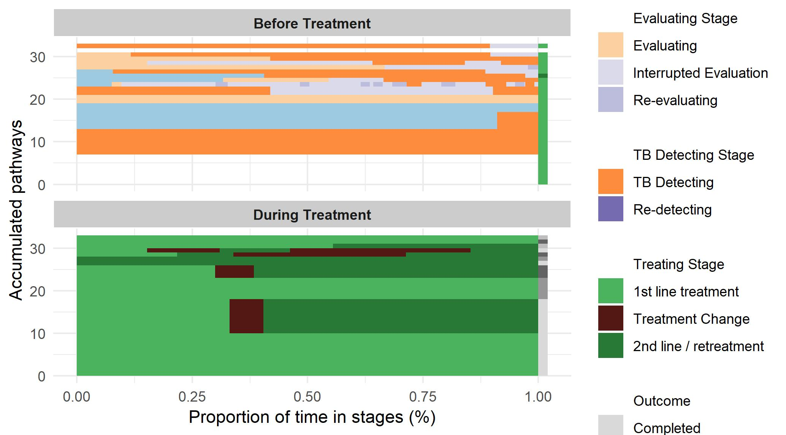
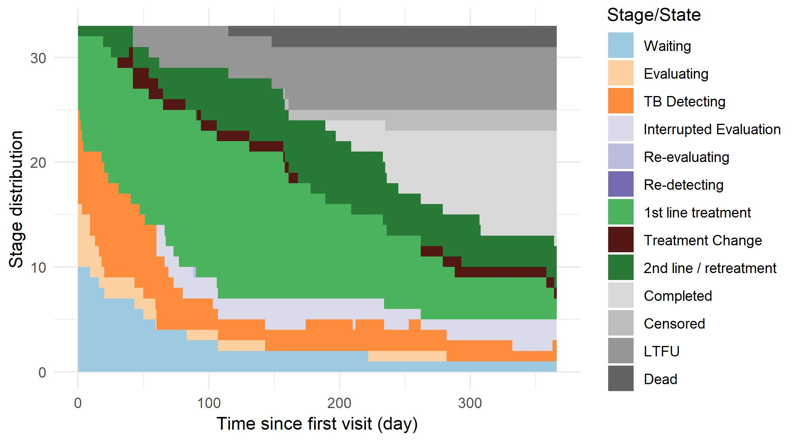
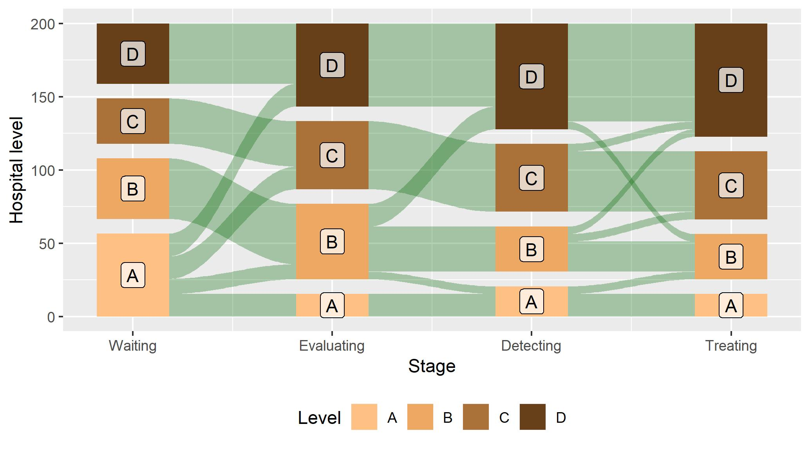
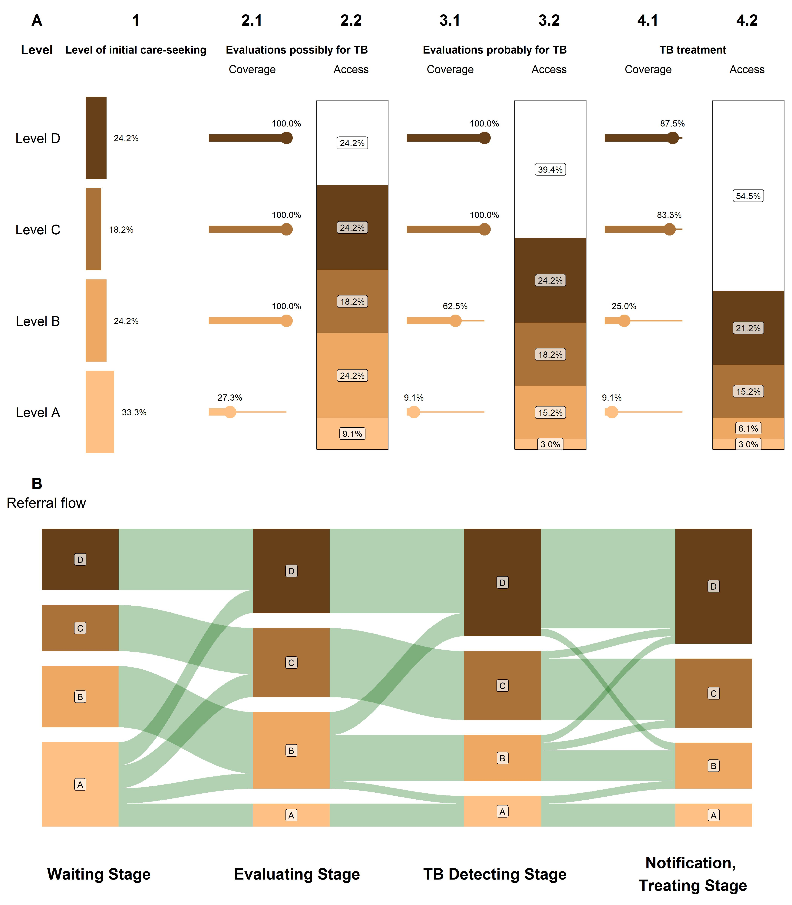
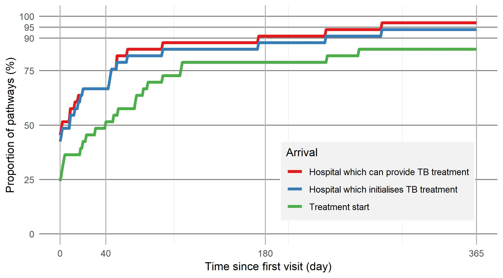

# IPPA-Vis
Visualisation tools for IPPA 

## Load IPPA-Vis

Install using devtools
```r
library(ippaVis)
```

## Pattern frequency diagram

```r
pat.freq <- visualise_pattern_freq(pseudo.tb.js)
print(pat.freq)
```

<a href="url"></a>

## Stage distribution diagram

```r
st.di <- visualise_stage_dist(pseudo.tb.js)
print(st.di)
```

<a href="url"></a>

## Referral diagram

```r
ref <- visualise_referrals(pseudo.tb.p, bar.width=40)
print(ref)
```
<a href="url"></a>

## Capacity and access diagram

```r
ppa <- visualise_accessibility(pseudo.tb.h, pseudo.tb.p)
print(ppa)
```
<a href="url"></a>


## Gap diagram

```r
gap <- gap_diagram(pseudo.tb.p)
print(gap)
```
<a href="url"></a>


## License
See [License](LICENSE.txt)
